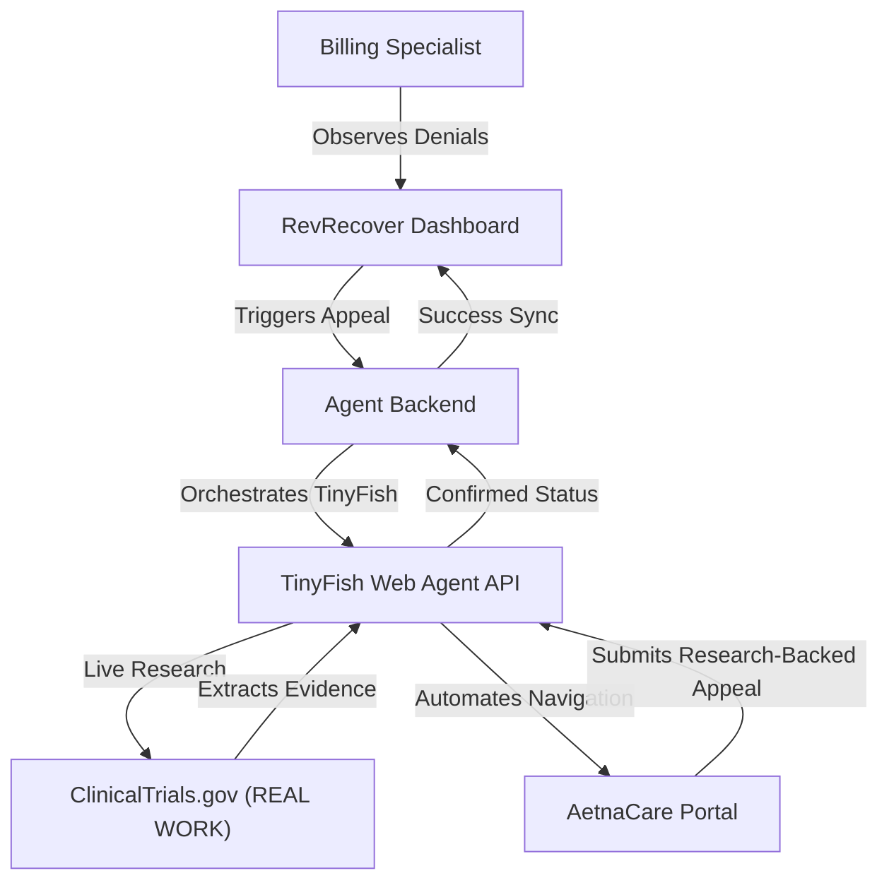

# RevRecover: Medical Claims Denial Appeal Agent

**RevRecover** is a "God Tier" automation suite designed for enterprise medical management. It solves the multi-billion dollar problem of medical insurance claim denials by utilizing the **TinyFish Agentic Web Framework** to automate the appeals process.

## 🚀 The Problem
Medical billing specialists spend hours manually logging into insurance portals to fight denied claims. **RevRecover** replaces this manual labor with a "Robot Staffing Agency" that logs in, analyzes the denial, and submits a professional appeal letter in seconds.

## 🛡️ Architecture
The suite consists of three core components:

1.  **[RevRecover App](./app):** A premium Vue/Vite command center where specialists manage denials and trigger agents.
2.  **[Agent Backend](./backend):** The orchestration layer that connects the dashboard to the TinyFish Web Agent API.
3.  **[Enterprise Portal](./enterprise-portal):** A high-fidelity insurance portal simulation built to prove the agent's ability to handle complex, messy web UIs.



### 🧠 Audit Intelligence
The dashboard includes an **Audit History** tab that provides full transparency into the agent's actions. It automatically parses the agent's end-to-end execution data to extract and display the exact clinical justification logic written by the agent during the appeal submission, complete with referenced trial data.

### ⚡ Async Polling Architecture
To ensure reliability on the cloud (Google Cloud Run), the platform uses a **True Asynchronous** orchestration pattern. 
- The Backend initiates the agent and returns a `run_id` immediately.
- The Dashboard polls for status every 10 seconds.
- This bypasses standard 60-second cloud gateway timeouts, allowing for complex 5+ minute research and automation tasks without connection drops.

## 🛠️ Getting Started

### 1. Clone the repository
```bash
git clone https://github.com/parulmalhotraiitk/RevRecoverTinyFish.git
cd RevRecoverTinyFish
```

### 2. Configure the Backend
Move to the `backend` directory, install dependencies, and set up your TinyFish API key.
```bash
cd backend
npm install
cp .env.example .env
# Edit .env and add your TINYFISH_API_KEY
npm start
```

### 3. Start the Enterprise Portal
The agent needs a target to act upon! Start the Payer simulation.
```bash
cd ../enterprise-portal
npm install
npm run dev
```

### 4. Launch the RevRecover App
Finally, start the RevRecover command center.
```bash
cd ../app
npm install
npm run dev
```

## ☁️ Deployment: Google Cloud Run (Production)

To securely orchestrate the TinyFish Cloud Agent, the suite runs completely natively on **Google Cloud**. This provides massive scalability without server timeouts.

### 1. Unified GCP Architecture
This project is containerized using Docker and is deployed across two serverless instances via Google Cloud Run:
- **`revrecover-backend`**: A Node.js container handling the API, Agent Orchestration, and the Simulated Provider Portal.
- **`revrecover-frontend`**: An Nginx container combining both the standard App and the Enterprise Portal into one static host.

### 2. Environment Variables & Secrets
For the agent to function in the cloud, configure the following secrets natively on your Cloud Run instances using Secret Manager:

| Component | Variable Name | Description |
| :--- | :--- | :--- |
| **Backend** | `TINYFISH_API_KEY` | Your secret API key to orchestrate the TinyFish agent. |
| **Backend** | `MONGODB_URI` | The connection string for your MongoDB Atlas cluster. |
| **Backend** | `MOCK_PORTAL_URL` | The public `.run.app` URL of the Backend itself (for internal web navigation). |
| **Frontend** | `VITE_API_URL` | *(Build Time)* The public URL of your Cloud Run Backend API. |

### 3. Multi-Payer Credential Vault 🔐🏢
RevRecover uses a secure, dynamic identity system to authenticate against different insurance portals. Set environment variables in your **Cloud Run Console** to manage multiple portals:
- `PAYER_[NAME]_USER`: Username for a specific provider (e.g., `PAYER_AETNA_USER`).
- `PAYER_[NAME]_PASS`: Password for a specific provider (e.g., `PAYER_AETNA_PASS`).

## 🔒 Security First: Protecting your Secrets
All API keys are held exclusively on the Backend Cloud Run instance and are **never** bundled into the Frontend JavaScript.


## 🎭 The Agent's Personas
RevRecover is designed to handle multiple roles within the healthcare ecosystem. During your demo, you can showcase these two distinct personas:

### 1. The Billing Admin (Provider Portal)
*   **Target:** Our built-in **Enterprise Portal** (`/portal`).
*   **Credentials:** Defaults to `admin` / `password`.
*   **The Story:** The agent acts as an employee of a hospital. It logs into the provider portal to check claim status, analyzes the denial, and submits a medical-necessity appeal based on real-time research from ClinicalTrials.gov.

### 2. The Medicare Beneficiary (Patient: Ezio Auditore)
*   **Target:** The official **CMS Blue Button 2.0 Sandbox**.
*   **Credentials:** `BBUser00000` / `PW00000!` (configured via secure environment variables).
*   **The Story:** The agent acts as the patient (**Ezio Auditore**). It navigates the official US Government security infrastructure to "Authorize" RevRecover to access medical records. This proves the agent can handle the most secure, regulated medical sites in the United States.

---

## 🎖️ Enterprise Proof: Live Medicare Demo
To demonstrate the agent's ability to interact with an **Official US Government Site**:

1.  **Set Credentials in Google Cloud Run (Env Vars):**
    *   `PAYER_BLUEBUTTON_USER` = `BBUser00000`
    *   `PAYER_BLUEBUTTON_PASS` = `PW00000!`
2.  **Dashboard Setup:** 
    *   Select **Ezio Auditore** (Claim: `CLM-999-CMS`) from the Dashboard queue.
    *   In the **"Live Agent Mode"** box, paste the **CMS Authorization URL** (e.g., `https://sandbox.bluebutton.cms.gov/testclient/authorize-link-v2`).
3.  **Execute:** Click **"Automate Appeal with Agent"**.
4.  **Observe:** The TinyFish agent will traverse to the official CMS login, enter the credentials, and approve the authorization autonomously.

> [!TIP]
> **For all other patients** (e.g., Eleanor Vance), simply leave the "Live Agent Mode" box empty or use your deployed **Enterprise Portal URL** to demonstrate the insurance appeal workflow.

---

## 💡 Why TinyFish?
RevRecover utilizes the unique power of the **TinyFish Agentic Framework** to solve challenges that traditional automation (like Selenium or Puppeteer) can't touch:
-   **Dynamic Research (Real Work):** The agent doesn't just click buttons; it visits live medical databases to find a "reason" to win the appeal.
-   **DOM Resilience:** Using natural language goals, the agent can navigate messy insurance portals even if the HTML structure changes.
-   **Zero-Human Logic:** It handles complex, multi-modal workflows (HIPAA popups, auth dialogs) autonomously without hardcoded scripts.

## 🏆 Key Features
-   **"God Tier" Aesthetic:** Platinum Enterprise UI with glassmorphism and depth effects.
-   **Live Agent Terminal Feed:** Real-time visibility into the AI's research and actions.
-   **Business Value Analytics:** Instant tracking of recovered revenue and human hours saved.
-   **Clinical Research Integration:** Demonstrates real, autonomous work on the live web.

---
Built with ❤️ by the RevRecover Team.
