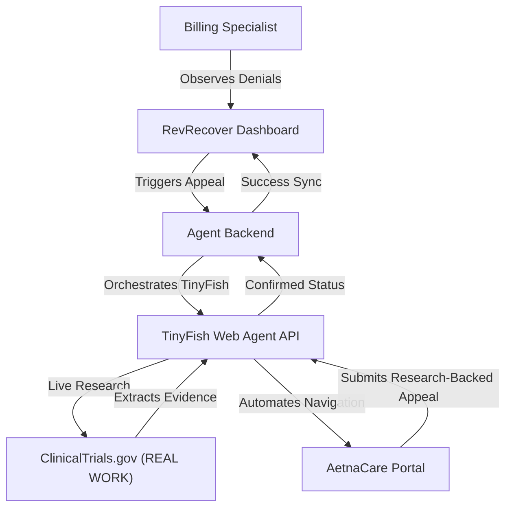

# RevRecover: Medical Claims Denial Appeal Agent

**RevRecover** is a "God Tier" automation suite designed for enterprise medical management. It solves the multi-billion dollar problem of medical insurance claim denials by utilizing the **TinyFish Agentic Web Framework** to automate the appeals process.

## 🚀 The Problem
Medical billing specialists spend hours manually logging into insurance portals to fight denied claims. **RevRecover** replaces this manual labor with a "Robot Staffing Agency" that logs in, analyzes the denial, and submits a professional appeal letter in seconds.

## 🛡️ Architecture
The suite consists of three core components:

1.  **[RevRecover App](./app):** A premium Vue/Vite command center where specialists manage denials and trigger agents.
2.  **[Agent Backend](./backend):** The orchestration layer that connects the dashboard to the TinyFish Web Agent API.
3.  **[Enterprise Portal](./enterprise-portal):** A high-fidelity insurance portal simulation built to prove the agent's ability to handle complex, messy web UIs.



### 🧠 Audit Intelligence
The dashboard includes an **Audit History** tab that provides full transparency into the agent's actions. It automatically parses the agent's end-to-end execution data to extract and display the exact clinical justification logic written by the agent during the appeal submission, complete with referenced trial data.

### ⚡ Async Polling Architecture
To ensure reliability on the cloud (AWS App Runner), the platform uses a **True Asynchronous** orchestration pattern. 
- The Backend initiates the agent and returns a `run_id` immediately.
- The Dashboard polls for status every 10 seconds.
- This bypasses standard 60-second cloud gateway timeouts, allowing for complex 5+ minute research and automation tasks without connection drops.

## 🛠️ Getting Started

### 1. Clone the repository
```bash
git clone https://github.com/your-username/revrecover.git
cd revrecover
```

### 2. Configure the Backend
Move to the `backend` directory, install dependencies, and set up your TinyFish API key.
```bash
cd backend
npm install
cp .env.example .env
# Edit .env and add your TINYFISH_API_KEY
npm start
```

### 3. Start the Enterprise Portal
The agent needs a target to act upon! Start the Payer simulation.
```bash
cd ../enterprise-portal
npm install
npm run dev
```

### 4. Launch the RevRecover App
Finally, start the RevRecover command center.
```bash
cd ../app
npm install
npm run dev
```

## ☁️ Deployment: AWS Amplify (Recommended)

To successfully demonstrate **"Real Work on the Web"**, you are hosting the suite on AWS Amplify. This allows the TinyFish Cloud Agent to access your Mock Portal over the public internet.

### 1. Monorepo Setup (Amplify Hosting)
Connect your GitHub repository to **AWS Amplify Hosting**. 
- Amplify will detect the root `amplify.yml` and automatically deploy both the **Dashboard** and the **Mock Portal** as separate sub-apps.

### 2. Environment Variables & Secrets
For the agent to function in the cloud, you must configure **Environment Variables** in the Amplify Console:

| Component | Variable Name | Description |
| :--- | :--- | :--- |
| **Backend** | `TINYFISH_API_KEY` | Your secret API key. Configure this in Amplify Secrets or App Runner. |
| **Backend** | `MOCK_PORTAL_URL` | The public URL of your **Enterprise Portal** (provided by Amplify). |
| **App** | `VITE_API_URL` | The public URL of your **Backend API**. |
| **Backend** | `AGENTOPS_API_KEY` | *(Partner)* AgentOps session observability — track every agent run. |
| **Backend** | `AXIOM_API_KEY` | *(Partner)* Axiom structured logging — search and visualize agent logs. |
| **Backend** | `AXIOM_DATASET` | *(Partner)* Axiom dataset name (default: `revrecover-logs`). |
| **Backend** | `ELEVENLABS_API_KEY` | *(Partner)* ElevenLabs TTS — AI voice proxy. Key is **never** sent to the browser. |

### 4. Multi-Payer Credential Vault 🔐🏢
RevRecover uses a secure, dynamic identity system to authenticate against different insurance portals.

#### Configuration
Set environment variables in your **AWS App Runner Console** to manage multiple portals:
- `PAYER_[NAME]_USER`: Username for a specific provider (e.g., `PAYER_AETNA_USER`).
- `PAYER_[NAME]_PASS`: Password for a specific provider (e.g., `PAYER_AETNA_PASS`).

#### Fallback Logic (Zero-Config Mode)
If no high-security environment variables are set, the system intelligently defaults to:
1. `PORTAL_USER` / `PORTAL_PASS`: A general-purpose credential pair.
2. `admin` / `password`: Hardcoded defaults specifically for the built-in **Simulation Portal**.

This ensures you can demo the **Simulation Mode** out-of-the-box without setting any passwords, while being 100% ready for "Real Work" on production websites.

### 3. "Real Work" Verification & Portal URLs
Once deployed, the dashboard's "Live Agent Mode" box allows you to specify the target portal:

1.  **Dashboard Input (Right Side):** Paste your **Enterprise Portal URL** (Amplify URL) here. This is the primary way the agent knows where to perform the "Action" phase of the workflow.
2.  **Default Logic (Priority):**
    -   **Tier 1:** `MOCK_PORTAL_URL` Environment Variable (checks this first).
    -   **Tier 2:** Dashboard Input URL (if Tier 1 is empty).
    -   **Tier 3:** `http://localhost:5173` (Local fallback for dev only).
3.  **Cross-Provider Flexibility:** While the prototype defaults to the "AetnaCare" aesthetic, the TinyFish agent is instructed based on the **selected Payer** (e.g., Aetna, United, Cigna). It will use the provided URL as its landing page and intelligently navigate to the specific provider's claim section using its session memory.

## 🔒 Security First: Protecting your Secrets

All API keys are held exclusively on the backend (App Runner) and are **never** bundled into the frontend JavaScript.

1.  **Backend Only (TinyFish & ElevenLabs):** Both the TinyFish and ElevenLabs API keys live in `backend/` environment variables only. The frontend calls `/api/tts` and `/api/run-agent` — it never touches raw secrets.
2.  **No `VITE_` secrets:** Any variable prefixed with `VITE_` is baked into the public JS bundle **at build time**. This means the key is permanently embedded as a plain string in your deployed `.js` files — visible to anyone who opens DevTools → Sources and searches the bundle, **even if the network request that uses the key is never triggered**. No secret keys use this prefix in this project.
3.  **`.gitignore` pre-configured:** All `.env` files are git-ignored in every subdirectory. Your keys will never be committed to GitHub.
4.  **Amplify vs App Runner:** Set `VITE_API_URL` in Amplify (frontend — safe, it's just a URL). Set all secret keys (`TINYFISH_API_KEY`, `ELEVENLABS_API_KEY`, etc.) only in **App Runner** (backend).
5.  **Backend Logging:** The backend will warn if a key is missing but will **never** log the actual key value.

Before pushing to GitHub, verify no secrets are present:
```bash
grep -r "API_KEY=" . --include="*.env"
```
*(Should return results only from local `.env` files, never from source files.)*


## 🎭 The Agent's Personas
RevRecover is designed to handle multiple roles within the healthcare ecosystem. During your demo, you can showcase these two distinct personas:

### 1. The Billing Admin (Provider Portal)
*   **Target:** Our built-in **Enterprise Portal** (`/portal`).
*   **Credentials:** Defaults to `admin` / `password`.
*   **The Story:** The agent acts as an employee of a hospital. It logs into the provider portal to check claim status, analyzes the denial, and submits a medical-necessity appeal based on real-time research from ClinicalTrials.gov.

### 2. The Medicare Beneficiary (Patient: Ezio Auditore)
*   **Target:** The official **CMS Blue Button 2.0 Sandbox**.
*   **Credentials:** `BBUser00000` / `PW00000!` (configured via secure environment variables).
*   **The Story:** The agent acts as the patient (**Ezio Auditore**). It navigates the official US Government security infrastructure to "Authorize" RevRecover to access medical records. This proves the agent can handle the most secure, regulated medical sites in the United States.

---

## 🎖️ Enterprise Proof: Live Medicare Demo
To demonstrate the agent's ability to interact with an **Official US Government Site**:

1.  **Set Credentials in AWS:**
    *   `PAYER_BLUEBUTTON_USER` = `BBUser00000`
    *   `PAYER_BLUEBUTTON_PASS` = `PW00000!`
2.  **Dashboard Setup:** 
    *   Select **Ezio Auditore** (Claim: `CLM-999-CMS`) from the Dashboard queue.
    *   In the **"Live Agent Mode"** box, paste the **CMS Authorization URL** (e.g., `https://sandbox.bluebutton.cms.gov/testclient/authorize-link-v2`).
3.  **Execute:** Click **"Automate Appeal with Agent"**.
4.  **Observe:** The TinyFish agent will traverse to the official CMS login, enter the credentials, and approve the authorization autonomously.

> [!TIP]
> **For all other patients** (e.g., Eleanor Vance), simply leave the "Live Agent Mode" box empty or use your deployed **Enterprise Portal URL** to demonstrate the insurance appeal workflow.

---

## 💡 Why TinyFish?
RevRecover utilizes the unique power of the **TinyFish Agentic Framework** to solve challenges that traditional automation (like Selenium or Puppeteer) can't touch:
-   **Dynamic Research (Real Work):** The agent doesn't just click buttons; it visits live medical databases to find a "reason" to win the appeal.
-   **DOM Resilience:** Using natural language goals, the agent can navigate messy insurance portals even if the HTML structure changes.
-   **Zero-Human Logic:** It handles complex, multi-modal workflows (HIPAA popups, auth dialogs) autonomously without hardcoded scripts.

## 🏆 Key Features
-   **"God Tier" Aesthetic:** Platinum Enterprise UI with glassmorphism and depth effects.
-   **Live Agent Terminal Feed:** Real-time visibility into the AI's research and actions.
-   **Business Value Analytics:** Instant tracking of recovered revenue and human hours saved.
-   **Clinical Research Integration:** Demonstrates real, autonomous work on the live web.

---
Built with ❤️ by the RevRecover Team.
